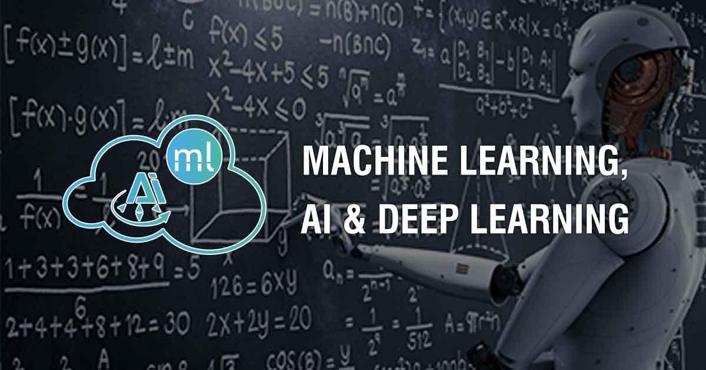
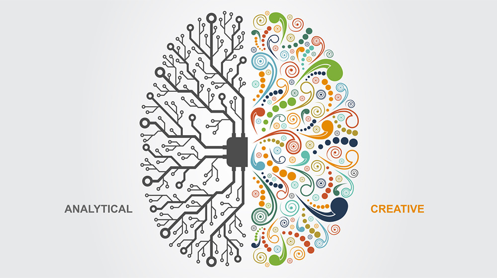
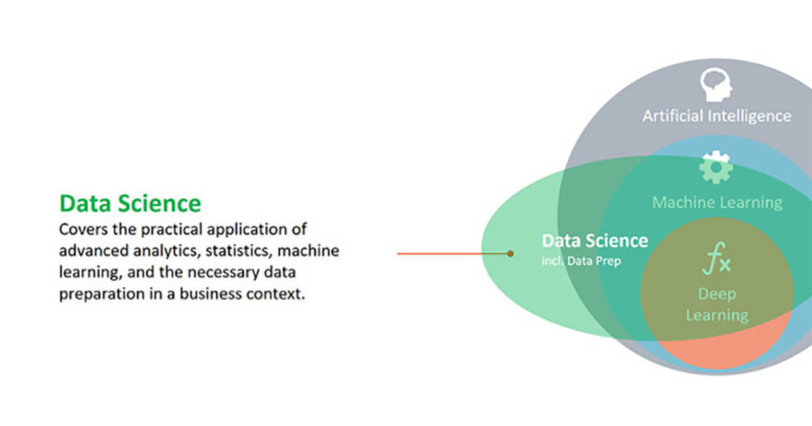

# MachineLearningUsingPython

Modern technologies like artificial intelligence, machine learning, data science and big data have become the buzzwords which everybody talks about off late. They seem very complex to a layman and people often get confused by words like AI, ML and data science. So, let's see what are these.

What is Data Science?

Data science is the extraction of relevant insights from data. It uses various techniques from many fields like mathematics, machine learning, computer programming, statistical modeling, data engineering and visualization, pattern recognition and learning, uncertainty modeling, data warehousing, and cloud computing.

Data science is the most widely used technique among AI, ML and itself. The practitioners of data science are usually skilled in mathematics, statistics, and programming (although expertise in all three is not required). Data scientists solve complex data problems to bring out insights and correlation relevant to a business. 

## What is Machine Learning?

Machine learning is the ability of a computer system to learn from the environment and improve itself from experience without the need for any explicit programming. Machine learning focuses on enabling algorithms to learn from the data provided, gather insights and make predictions on previously unanalyzed data using the information gathered. Machine learning can be performed using multiple approaches. The three basic models of machine learning are supervised, unsupervised and reinforcement learning.

Machine learning algorithms are used in a wide variety of applications, such as email filtering, computer vision, credit-card fraud detection, recommendation engines, sentiment analysis, etc. 

## What is Artificial Intelligence (AI)?

Artificial intelligence refers to the simulation of a human brain function by machines. This is achieved by creating an artificial neural network that can show human intelligence. The primary human functions that an AI machine performs include logical reasoning, learning and self-correction. Artificial intelligence is a wide field with many applications but it also one of the most complicated technology to work on. Machines inherently are not smart and to make them so, we need a lot of computing power and data to empower them to simulate human thinking. 

The Difference between Artificial Intelligence, Machine Learning and Data Science:

Artificial intelligence is a very wide term with applications ranging from robotics to text analysis. It is still a technology under evolution. Machine learning is a subset of AI that focuses on a narrow range of activities. It is, in fact, the only real artificial intelligence with some applications in real-world problems.

Data science isn’t exactly a subset of machine learning but it uses ML to analyze data and make predictions about the future. It combines machine learning with other disciplines like big data analytics and cloud computing. Data science is a practical application of machine learning with a complete focus on solving real-world problems. 

## REPOSITORY OVERVIEW
This repository is about different Data Science, Machine Learning & Artificial Intelligence algorithm approaches as per the industry practices.

## TABLE OF CONTENTS
1. Machine Learning Project - Predict FIFA 2018 Man of the Match

The FIFA World Cup, often simply called the World Cup, is an international association football competition contested by the senior men's national teams of the members of the Fédération Internationale de Football Association (FIFA), the sport's global governing body. The championship has been awarded every four years since the inaugural tournament in 1930, except in 1942 and 1946 when it was not held because of the Second World War. The current champion is France, which won its second title at the 2018 tournament in Russia.

The current format of the competition involves a qualification phase, which currently takes place over the preceding three years, to determine which teams qualify for the tournament phase, which is often called the World Cup Finals. After this, 32 teams, including the automatically qualifying host nation(s), compete in the tournament phase for the title at venues within the host nation(s) over a period of about a month.

The 21 World Cup tournaments have been won by eight national teams. Brazil have won five times, and they are the only team to have played in every tournament. The other World Cup winners are Germany and Italy, with four titles each; Argentina, France and inaugural winner Uruguay, with two titles each; and England and Spain with one title each.
